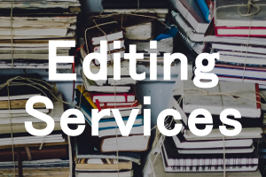

### 
We'll help you bring your book to light

Book Light Editorial exists to help refine your vision and make your book the best possible version of itself. We can take your manuscript and develop it until it is the book you envisioned.

##### What does that mean?

Well, we suggest starting with a developmental edit. This type of edit looks at the big-picture aspects of your manuscript, such as plot, character development, story arc, and pacing. It helps make sure you are accurately conveying your vision to readers and that your story is something that will hook readers in and maintain their interest.

After that, it is time for a copyedit. Copyediting works on the spelling, grammar, punctuation, and consistency within your book. No author can catch all the typos within a manuscript; you see what you expect to read, not what is actually on the page. Copyeditors provide fresh eyes with which to spot these gaps. This is the final polish before a manuscript is ready to become a published book.

##### Are you ready to dive into the wonderful world of editing?

 

###### Sidebar

! NOTE: The page will automatically show up in the Menu after the "Home" menu item. If you wish to change the name that shows up in the Menu, simple add: `menu: My Page` between the dashes in the page content. This is called the YAML front matter, and it is where you configure page-specific options.
